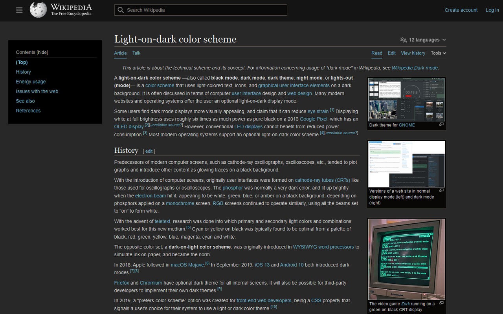

# wikipedia-darkmode

This chrome extension is a simple dark mode for Wikipedia

## Changelog

### [0.3]

- Fix Math elements color

### [0.2]

- Use CSS injection
- Customize css
- Remove script injection
- Remove all access permissions (useless for css injection)

### [0.1]

- Release